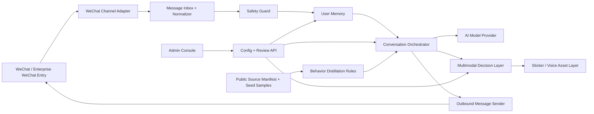

# Architecture Overview

## Product Context

微信树洞 AI is a multi-platform product with a WeChat-side entry, an AI companion backend, and a lightweight admin console. The confirmed MVP is for the owner and a few invited friends. It must support text conversation, sticker intent, short voice scripts, memory, public-sample behavior distillation, and safety fallback.

## Recommended Architecture

Use a modular monolith for the MVP: one backend application with clearly separated modules, one database, one background worker, and one admin frontend.

This gives the product enough structure for safety and future iteration without making the first build too slow or fragile. If the product grows later, the WeChat adapter, AI orchestration, media service, and admin console can be split out.

## High-Level System

## Main Product Flows

### User Conversation Flow

1. The user sends a WeChat-side message.
2. The WeChat Channel Adapter receives or fetches the message.
3. The message is normalized into one internal format.
4. Safety Guard checks whether playful mode is allowed.
5. User Memory retrieves only allowed preference context.
6. Conversation Orchestrator decides the response plan.
7. AI Model Provider generates text or a voice script.
8. Multimodal Decision Layer decides whether to add sticker intent or voice intent.
9. Outbound Message Sender sends the allowed reply through the WeChat-side channel.
10. Logs and lightweight memory updates are stored.

### Admin Flow

1. The owner opens the admin console.
2. The owner sees user status, memory settings, source status, and run health.
3. The owner adjusts tone, memory, sticker, or voice rules.
4. The backend applies the new configuration to later conversations.

### Behavior Distillation Flow

1. Public sources are recorded in `data/public_sources/data_sources.json`.
2. Each source is tagged by license, traffic cost, and product fit.
3. Large sticker, voice, or dataset downloads stay deferred until the user is off VPN.
4. Allowed sources inform rules and synthetic examples rather than copied replies.
5. Distilled rules feed the Conversation Orchestrator.

## WeChat Integration Assumptions

The MVP remains based on the Enterprise WeChat / WeChat customer-service style route. During implementation planning, the following official capabilities must be rechecked against current Tencent documentation:

- Receiving WeChat customer-service messages or events.
- Sending customer-service replies.
- Message window and send-count limits.
- Media upload requirements for image, voice, file, or video messages.
- Whether sticker-like behavior should be sent as image media rather than native WeChat stickers.

The architecture isolates these details inside the WeChat Channel Adapter and Media Layer so product logic does not depend directly on one unstable platform detail.

## Risk Summary

| Risk | Architectural Response |
|---|---|
| WeChat API limitations change | Keep platform logic inside the WeChat Channel Adapter |
| Sticker asset copyright is unclear | Store sticker intent first; attach real assets only after rights review |
| Voice cloning or consent risk | Use generic or product-owned voice only; no real-person cloning |
| AI gives unsafe playful reply | Safety Guard runs before multimodal decisions |
| User memory feels invasive | Memory module stores limited preferences and supports clearing |
| Public data license confusion | Source manifest tracks license tier and product-use status |

